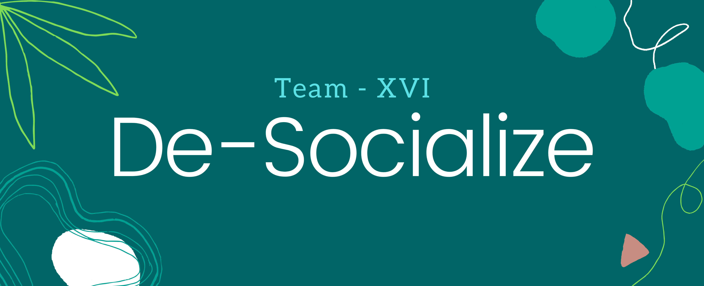

## **Hello beautiful humans!** <br>
I am Aakash Mattoo. As we all know Module-III was a FLIPPED classroom and ME and MY GROUP, explained the topic **SERVICE DESIGN**. We used certain PDFs and links for the same. So I am sharing all those PDFs and links below for your help.

<hr>
```markdown
```
<hr>

# PowerPoinT
The is our presentation.
<a href="SERVICE-DESIGN-ppt.pdf" target="_blank"><br>
	<button>content-PPT</button> </a> 
	


<p align="center">
  
</p>


# ABSTRACT-PDFs
The below is an abstract PDF from the content of PPT. 
<br>
<a href="SERVICE-DESIGN-abstract.pdf" target="_blank">
	<button>ABSTRACT-PDF</button> </a> 

	


<p align="center">
  
</p>


# HyperLinks

* <a href="https://boagworld.com/audio/service-design/#Why_is_Service_Design_a_Thing?" target="_blank">Why is Service Design a thing</a>
* Know more about <a href="https://www.nngroup.com/articles/service-design-101/" target="_blank">Service Design</a>
* <a href="https://brand24.com/blog/3-real-life-examples-of-good-customer-service-in-retail-from-companies-large-and-small/" target="_blank">Service Design impacts PEOPLE</a>
* <a href="https://www.interaction-design.org/literature/article/customer-touchpoints-the-point-of-interaction-between-brands-businesses-products-and-customers"  target="_blank">Customer Touchpoints</a>
* <a href="https://www.conductor.com/blog/2019/01/what-is-a-touchpoint-marketing-touchpoints-on-a-buyers-journey-in-2019/" target="_blank">What is a TOUCHPOINT?</a>
* <a href="https://medium.com/@angelquicksey/service-design-for-policy-b0a9408dced1#_ftn22" target="_blank">Service Design in a POLICY Environment</a>
* <a href="https://creativeword.uk.com/blog/localization/culture-influences-design/" target="_blank">How Culture Influences Design?</a>


<p align="center">
  
</p>


# Downloadable-PDFs

* <a href="Agile_Service_Design_Framework_Enfocus_Solutions.pdf" target="_blank">Click here to know about <b>SERVICE DESIGN</b></a>  OR 
  <br><a href="Agile_Service_Design_Framework_Enfocus_Solutions.pdf" download="Agile_Service_Design_Framework_Enfocus_Solutions.pdf">
    <button>Download PDF</button></a>
* <a href="sd.pdf" target="_blank">Click here to know more about <b>SERVICE DESIGN</b></a>  OR 
  <br><a href="sd.pdf" download="sd.pdf">
    <button>Download PDF</button></a>
* <a href="Design methods for developing services.pdf" target="_blank">Click to know about<b> DEVELOPING SERVICES</b></a>  OR 
  <br><a href="Design methods for developing services.pdf" download="Design methods for developing services.pdf">
    <button>Download PDF</button></a>
* <a href="Service Design as a Cultural Intermediary Translating cultural phenomena into services.pdf" target="_blank">Click to know about<b> Service Design as a Cultural Intermediary</b></a>  OR 
  <br><a href="Service Design as a Cultural Intermediary Translating cultural phenomena into services.pdf" download="Service Design as a Cultural Intermediary Translating cultural phenomena into services.pdf">
    <button>Download PDF</button></a>
 * <a href="DS42_P_554.pdf" target="_blank">Click to know about<b> CULTURAL INFLUENCES</b></a>  OR 
  <br><a href="DS42_P_554.pdf" download="DS42_P_554.pdf">
    <button>Download PDF</button></a>

<hr>
```markdown
```
<hr>
# Support or Contact

Having trouble with downloading PDFs/opening LINKS. Contact me through WhatsApp or VIT-B mail <br> ```aakash.mattoo2019@vitbhopal.ac.in```.
	
<hr>



